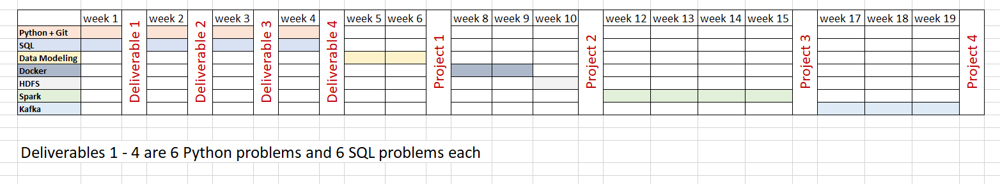

# Proposed Timeline for Level 1

This timeline aims to help anyone in tacking the different topics in level with suggested pace. This is not a rigid timeline whatsoever. Instead of treating it as a set of absolute deadlines, think of it as a good starting point which you can customize further for your learning pace and available time.

## Python + Git (Suggested Weeks: 4)
- Git (add, rm, commit, checkout, branch, pull, push, merge)
- Data Structure & Algorithms (Stack, Queue, Linked List, Tree, Hashset, Sorting Algorithms, Searching Algorithms, String Manipulation)
- Pandas & Numpy
- Problem Solving

## SQL (Suggested Weeks: 4)
- Syntax
- Joins
- Aggergation Functions
- Window Functions
- Indexes Types
- Views (Materalization, Inserting into views)
- Problem Solving

## Data Modeling (Suggested Weeks: 2)
- Star & Snowflake Schema
- Fact Types
- Dimension Types

## Docker (Suggested Weeks: 2)
- docker
- docker-compose

## HDFS (Suggested Weeks: 1)
- Hadoop Distributed FileSystem (Namenode, Datanode)

## Spark (Suggested Weeks: 4)
- DataFrames
- Accumulators & Broadcast Variables
- Partitioning & Caching
- SparkSQL

## Kafka (Suggested Weeks: 3)
- Python API
- Cluster Configurations

## Deliverables and Projects
Deliverables are sets of 6 LeetCode SQL problems + 6 LeetCode python problem. It's highly encouraged to solve one problem of each everyday but if for some reason one can not, you can solve them all in one or two days.

Multiple Projects can be found under each subject.